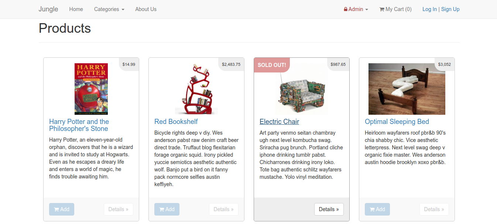
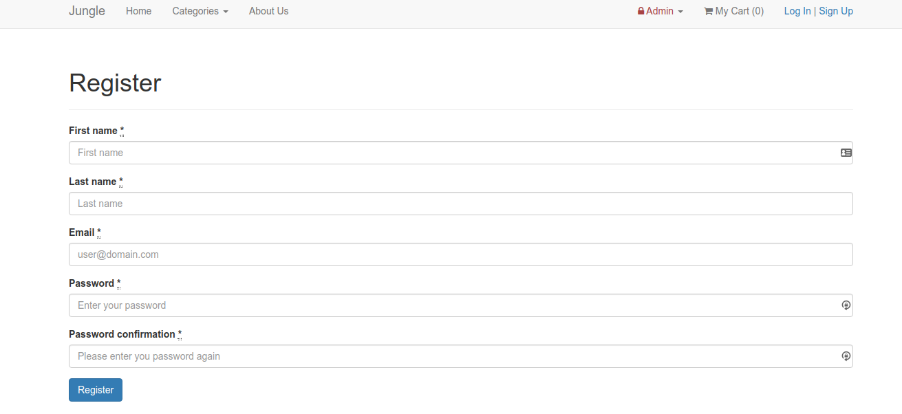
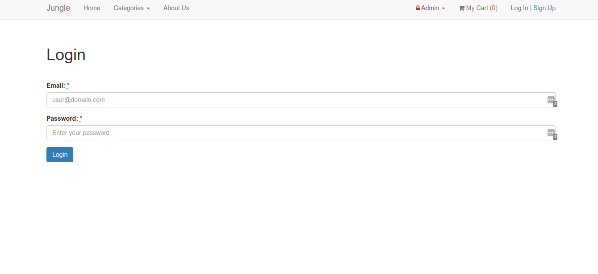
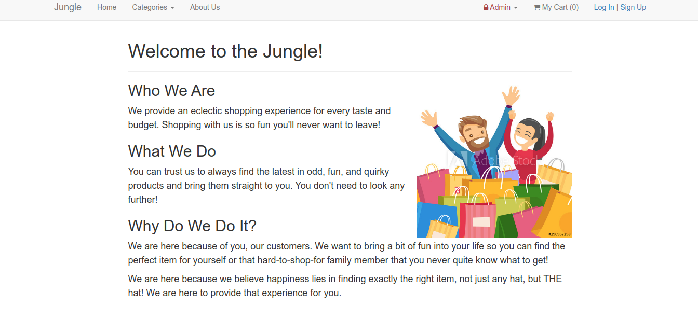
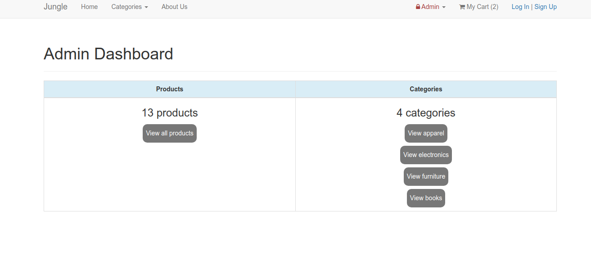
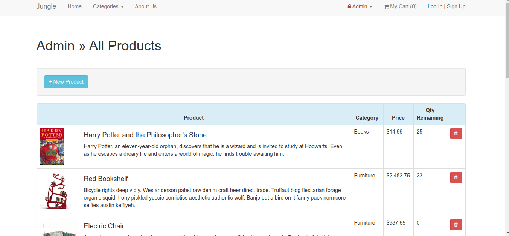
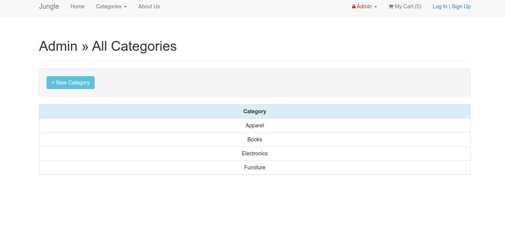
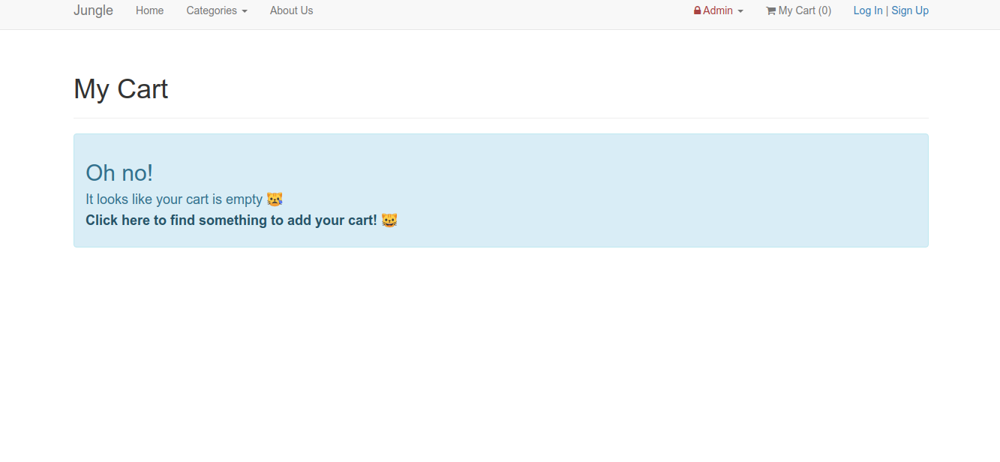
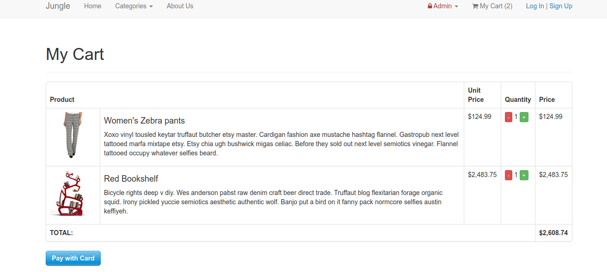

# Jungle

A mini e-commerce application built with Rails 4.2 for purposes of teaching Rails by example. This project was built to emulate the real world, being dropped into an unfamiliar codebase where we don't already know the language. We needed to learn how to use Rails as well as recognizing what the code was doing in a large file structure. New features, bug fixes, and automated testing with RSpec and Capybara were implemented.

# Table of Contents
* [Tech Stack](#tech-stack)
* [New Features](#new-features)
* [Bug Fixes](#bug-fixes)
* [Screenshots](#screenshots)
* [Development](#development)
  * [Dependencies](#dependencies)
  * [Database Setup](#database-setup)
  * [Jungle Setup](#jungle-setup)
  * [Running the Server](#running-the-server)
  * [Stripe Testing](#stripe-testing)
  * [Model Testing](#model-testing)
  * [Feature Testing](#feature-testing)

## Tech Stack
* Ruby on Rails
* Active Record (PSQL)
* CSS (Bootstrap)
* RSpec
* Capybara

## New Features
* <b>Sold Out Badge</b> - If product quantity is less than 0, a sold out badge is added and "Add to cart" is disabled.
* <b>Admin Categories</b> - Administrators can add new product categories.
* <b>User Authentication</b> - Users can sign up or log in to save payment information and purchase history.
* <b>Order Details Page (Enhancement)</b> - Order details can be viewed, purchase email is displayed and users receive a confirmation email about their purchase.
* <b>About Page</b> - An about page has been added for the site.
* <b>Automated Testing</b> - Testing for product model and user authentication has been added with RSpec and Capybara.
* <b>Styling</b> - All forms and alerts have been styled for presentation.

## Bug Fixes
* <b>Missing Admin Security</b> - Administrators need to log in before viewing admin dashboard, products, or categories pages. New items cannot be added unless logged in as an administrator.
* <b>Empty Cart</b> - If there are no items in the cart the user receives an error notice and link to the product page so they can add items to the cart.
* <b>Inconsistent Money Display</b> - Dollar amounts are displayed across the site instead of cents.

## Screenshots
Users can view all available products on the home page. Sold out products have a sold out badge and disabled add button.<br>



Users can register to use the site if they want to save their purchase history. They can also login on future visits<br>




If users want to know more about Jungle, they can visit the About Us page.<br>



Administrators have access to an Admin Dashboard displaying product and category counts, as well as links to the pages.<br>



Administrators can also view a products and categories page where they can add new products or categories, and remove products if needed.<br>




Users receive an error message and link to home page if there is nothing in the cart, and can view product details if items are being purchased.<br>




# Development

## Dependencies

* Rails 4.2 [Rails Guide](http://guides.rubyonrails.org/v4.2/)
* PostgreSQL 9.x [PSQL 9.0 docs](https://www.postgresql.org/docs/9.0/index.html)
* Stripe [Stripe](https://stripe.com/en-ca)
* See `Gemfile` for gem dependencies

## Database Setup
Log into Postgres as superuser:<br>
`sudo -u postgres psql`<br
Create the development database:<br>
```
CREATE USER jungle_development WITH NOSUPERUSER PASSWORD 'development';
CREATE DATABASE jungle_devlopment OWNER jungle_development;
GRANT ALL ON DATABASE jungle_devlopment TO jungle_development;
```

## Jungle Setup
1. Project setup:
```
cd <project-directory>
git clone git@github.com:kelsi2/jungle.git
cd jungle
bundle install
```
2. Create config/database.yml by copying config/database.example.yml.
3. Create config/secrets.yml by copying config/secrets.example.yml.
* These files should be modified to match your database credentials
4. Create, load, and seed the database:<br>
`bin/rake db:reset`
5. Create `.env` by copying `.env.example` and modify the Stripe keys to match the ones from your account. The admin login credentials can be changed or used as-is for testing.

## Running the Server
To start the server normally:<br>
`bin/rails server`

If using a virtual machine run the server using:<br>
`bin/rails server -b 0.0.0.0`

## Stripe Testing
See the Stripe docs [Stripe docs](https://stripe.com/docs/testing#cards) for setting up payment testing. <br>
Use credit card number 4111 1111 1111 1111 for testing successful orders.

## Model Testing
Use `bin/rspec --format documentation` to run automated RSpec model tests. The format documentation flag provides a readable format in the command line output.

## Feature Testing
Feature tests have been created with Capybara and Poltergeist. It is best to only run one test at a time since these take some time to run.<br>
`bin/rspec spec/features/<filename>`